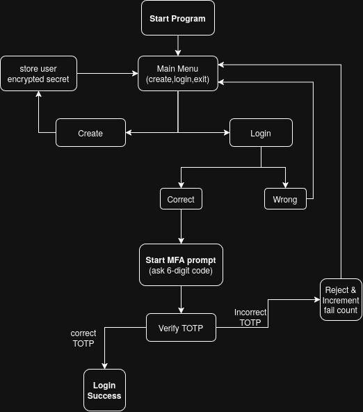

# Offline MFA CLI (Python)

An **offline, security-focused Multi-Factor Authentication (MFA) system** implemented as a command-line application in Python. This project is designed to demonstrate how real-world MFA systems work internally, without relying on any network services or external servers.

The goal of this project is not just to "add an OTP", but to correctly implement the **entire MFA lifecycle** — from credential storage and secret protection to recovery mechanisms and brute-force defense.

---

## 🧭 High-Level Flow Diagram

> 

---

## ✨ Key Features

- **Password authentication** using Argon2 (memory-hard hashing)
- **Time-based One-Time Passwords (TOTP)** using HMAC-SHA256
- **Authenticator app support** (Google Authenticator, Authy, etc.)
- **QR code provisioning** directly in the terminal
- **One-time backup / recovery codes** (securely hashed)
- **Rate limiting** for password and MFA attempts
- **Temporary account lockout** with a countdown timer
- **Encrypted storage of MFA secrets** using AES-256-GCM
- **SQLite database** for local persistence

---

## 🧠 Design Philosophy

This project follows the same principles used in real authentication systems:

- **Separation of factors**
  Passwords authenticate _who you are_, MFA verifies _what you have_.

- **Strict authentication order**
  Backup codes are only offered _after_ successful password verification and a failed MFA attempt.

- **Defense in depth**
  Even if the database is stolen, encrypted MFA secrets and hashed credentials prevent immediate compromise.

- **Fail-safe behavior**
  Repeated failures result in temporary lockout rather than silent retries.

---

## 🔐 Authentication Flow (Detailed)

1. User enters **username and password**
2. Password is verified using **Argon2id**
3. If correct, user is prompted for a **6-digit TOTP**
4. If TOTP verification fails, a **backup code** can be used
5. Successful authentication resets all counters
6. Repeated failures trigger **temporary account lockout**

Backup codes act as a **fallback for the second factor**, not as a replacement for the password.

---

## 🗄️ Data Storage Overview

All data is stored locally in an SQLite database (`mfa.db`). The database contains:

- Username
- Argon2 password hash
- Encrypted TOTP secret
- Hashed backup codes (one-time use)
- Failed password attempt counter
- Failed MFA attempt counter
- Lockout expiration timestamp

No sensitive data is stored in plaintext.

---

## 🔑 Key Management (`master.key`)

To protect MFA secrets at rest, the application generates a local **AES-256-GCM master key** on first run:

- Stored in `master.key`
- Used only to encrypt/decrypt TOTP secrets
- Generated per installation
- **Never committed to version control**

If the database is compromised without the master key, MFA secrets remain protected.

---

## 🚦 Rate Limiting & Lockout

To prevent brute-force attacks:

- Password attempts are limited
- MFA attempts (TOTP + backup codes) are limited
- After exceeding limits, the account is **temporarily locked**
- A live countdown shows how long remains until unlock

This mirrors behavior found in real authentication systems.

---

## 📦 Setup Instructions

### 1. Create a virtual environment

```bash
python3 -m venv venv
source venv/bin/activate
```

### 2. Install dependencies

```bash
pip install -r requirements.txt
```

### 3. Run the application

```bash
python MFA.py
```

---

## 📁 File Structure

```
offline-mfa-cli/
├── MFA.py                  # Main application logic
├── README.md               # Project documentation
├── requirements.txt        # Python dependencies
├── .gitignore              # Git ignore rules
├── master.key              # AES-256 master key (generated at runtime, NOT committed)
├── mfa.db                  # SQLite database (generated at runtime, NOT committed)
└── images/
    └── mfa_flow_diagram.png  # MFA flow / activity diagram
```

---

## 🧪 Testing the System

Suggested test cases:

- Wrong password → authentication stops immediately
- Correct password + correct TOTP → login success
- Correct password + wrong TOTP → backup code prompt
- Reusing a backup code → rejected
- Multiple failed attempts → temporary lockout with countdown

---

## 🎓 Learning Outcomes

This project demonstrates:

- Correct MFA system design
- Secure password storage
- Encrypted secret handling
- Recovery mechanisms without weakening security
- Rate limiting and lockout strategies
- Offline authentication architecture

---
